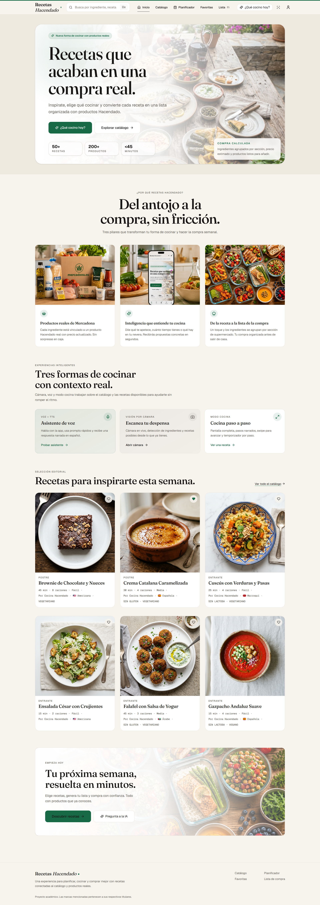
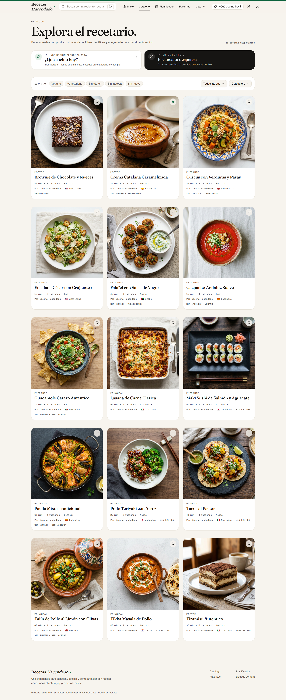
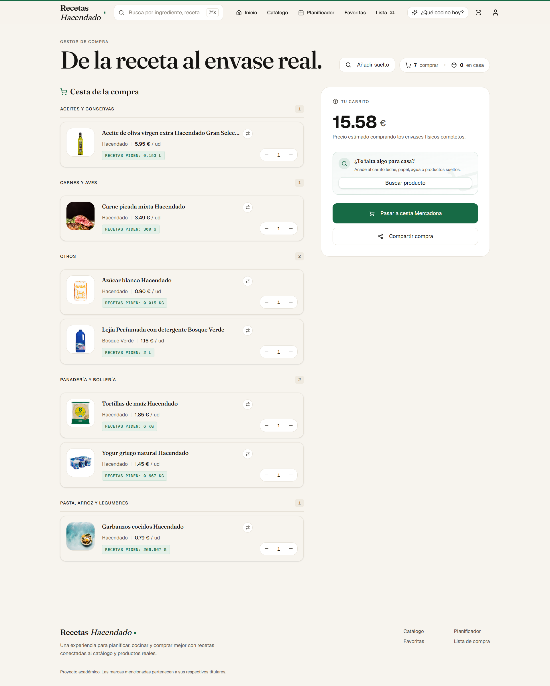
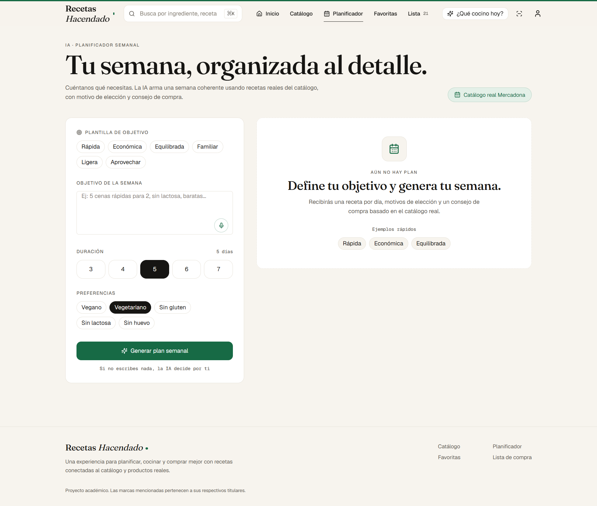
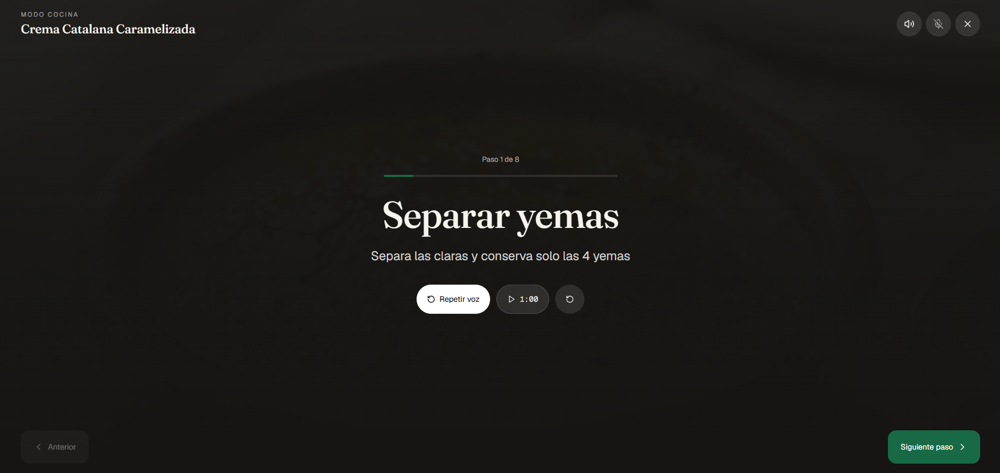
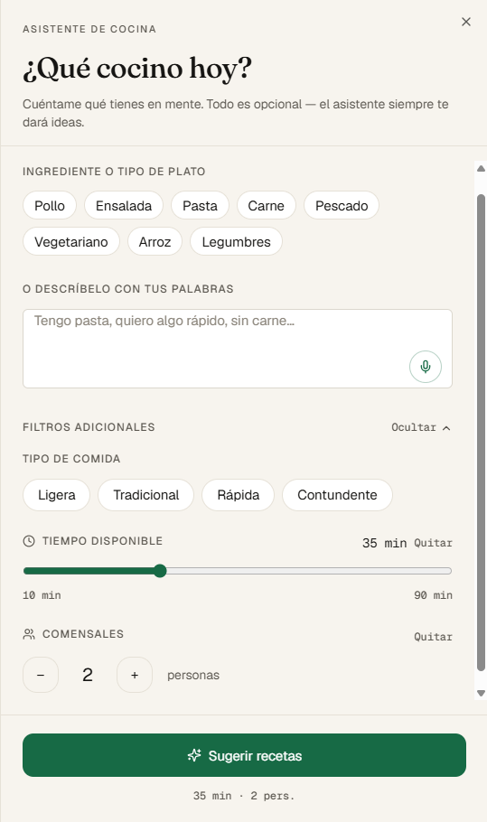
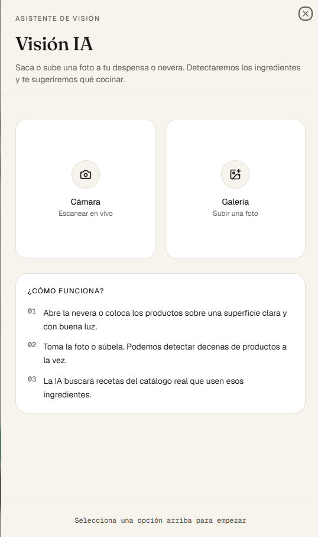
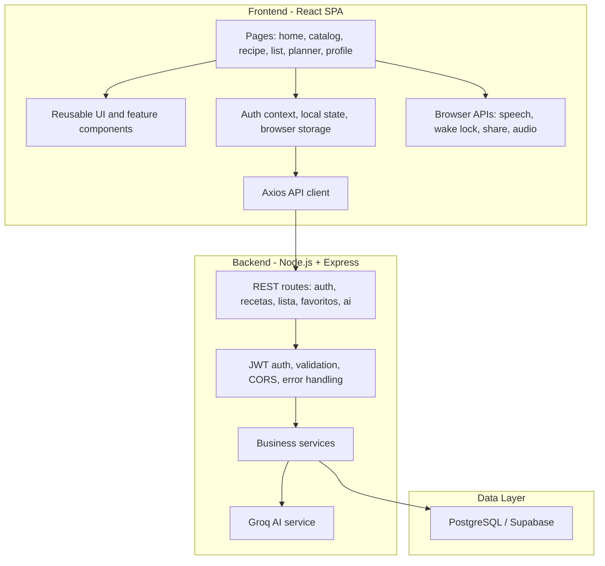

# Recetas Hacendado

Academic full-stack project for recipe planning, supermarket-aware shopping lists, and AI-assisted meal planning.

> This project was developed for academic purposes in a university context. It is not an official Mercadona or Hacendado product, nor is it affiliated with, endorsed by, or deployed by Mercadona as a commercial service.

## At a Glance

- **Context:** university project developed by the CyberPandas team in a Project Management / Software Engineering setting.
- **Industry input:** built with collaboration and feedback from Mercadona's team during the academic challenge.
- **Result:** selected as **2nd out of 12 teams** in the academic competition.
- **Problem solved:** helps users choose recipes, map ingredients to supermarket products, estimate cost, and consolidate a practical shopping list.
- **Scope:** full-stack web app with authentication, recipe catalog, shopping list engine, favorites, AI recipe assistance, pantry scanner, and weekly meal planner.

## Project Context

Recetas Hacendado was created as a university academic project, not as a commercial product. The challenge was to solve a realistic supermarket and recipe-planning problem using full-stack development, AI features, and Scrum delivery practices.

The team received collaboration and feedback from Mercadona's team as part of the university environment. In a competitive academic setting with 12 teams, our team was selected as 2nd. The final result is presented here as a professional academic portfolio project: honest about its origin, but polished enough to discuss architecture, product decisions, and engineering trade-offs in internship interviews.

## Main Features

- **Recipe catalog:** searchable recipes with images, difficulty, time, dietary tags, and detailed recipe pages.
- **Recipe detail:** ingredients mapped to products, dynamic serving scaling, price estimation, cooking steps, tips, FAQ, reviews, and related recipes.
- **Hands-free cooking mode:** step-by-step cooking overlay with text-to-speech, voice commands, timers, wake lock, haptic feedback, and progress persistence.
- **Smart shopping list:** consolidates ingredients across recipes, calculates required packages, groups products by supermarket section, tracks pantry items, supports product alternatives, manual product search, sharing, and estimated total cost.
- **AI assistant:** suggests recipes from the app catalog based on preferences, mood, time, or available ingredients.
- **Pantry scanner:** suggests zero-waste recipes from ingredients the user already has.
- **AI weekly planner:** generates a 3-7 day meal plan with dietary preferences, goals, total cooking time, shopping advice, and one-click add-to-list.
- **Authentication and profile:** JWT auth, registration, login, dietary preference onboarding, favorites, profile editing, and password update.

## Screenshots / Demo

The repository includes full-page app screenshots in the `img/` folder:

| Home | Catalog | Shopping List | Planner |
|------|---------|---------------|---------|
|  |  |  |  |

| AI Assistant | AI Suggestions | Pantry Scanner |
|--------------|----------------|----------------|
|  |  |  |

## Tech Stack

| Layer | Technology |
|-------|------------|
| Frontend | React 19, Vite 8, React Router, Tailwind CSS v4, Framer Motion, Radix UI, Lucide React |
| Backend | Node.js, Express 5, Joi, JWT, bcryptjs |
| Database | PostgreSQL hosted through Supabase |
| AI | Groq SDK with Llama models for chat, planning, pantry analysis, and cooking-mode assistance |
| Browser APIs | SpeechSynthesis, SpeechRecognition, Wake Lock, Vibration, Web Audio, Web Share |
| Tooling | ESLint, npm lockfiles, GitHub Actions CI |

## Architecture Overview



## Project Structure

```text
Scrum-Mercadona-CyberPandas/
├── backend/
│   ├── api/                    # Vercel serverless entrypoint
│   ├── src/
│   │   ├── config/             # Database connection
│   │   ├── database/           # Migrations, seeds, import scripts
│   │   ├── middleware/         # Auth, validation, error handling
│   │   └── modules/            # auth, recetas, lista, favoritos, ai
│   ├── server.js               # Local Express server
│   ├── package.json
│   └── .env.example
├── frontend/
│   ├── public/                 # PWA assets and recipe images
│   ├── src/
│   │   ├── api/                # API service layer
│   │   ├── components/         # UI, layout, common, AI sheets
│   │   ├── context/            # Auth context
│   │   ├── hooks/              # Custom hooks
│   │   ├── lib/                # Store, adapters, utilities, speech helpers
│   │   ├── pages/              # App routes
│   │   └── styles/             # Global styles
│   ├── package.json
│   └── .env.example
├── docs/                       # Architecture, Scrum, design, delivery docs
├── img/                        # README and portfolio screenshots
└── README.md
```

## Getting Started

### Prerequisites

- Node.js 20 or newer
- npm
- PostgreSQL database, for example Supabase
- Groq API key for AI features

### 1. Clone

```bash
git clone https://github.com/yaboula/Recetas-Hacendado.git
cd Recetas-Hacendado
```

### 2. Backend

```bash
cd backend
npm ci
cp .env.example .env
npm run setup-db
npm run dev
```

The API runs by default at `http://localhost:3001/api/v1`.

### 3. Frontend

```bash
cd frontend
npm ci
cp .env.example .env
npm run dev
```

The Vite app runs by default at `http://localhost:5173`.

## Environment Variables

### Backend

| Variable | Purpose |
|----------|---------|
| `DATABASE_URL` | PostgreSQL connection string |
| `JWT_SECRET` | Secret used to sign JWT tokens |
| `JWT_EXPIRES_IN` | Token lifetime, for example `7d` |
| `PORT` | Local API port |
| `NODE_ENV` | Runtime environment |
| `FRONTEND_URL` | Optional allowed frontend origin for CORS |
| `GROQ_API_KEY` | Groq API key |
| `GROQ_TEXT_MODEL` | Text model for AI features |
| `GROQ_VISION_MODEL` | Vision model for pantry scanning |

### Frontend

| Variable | Purpose |
|----------|---------|
| `VITE_API_URL` | Backend API base URL |

## Technical Highlights

- **Shopping list consolidation:** backend logic aggregates ingredient quantities across multiple recipes and calculates required product packages.
- **Cost estimation:** recipe and list prices are derived from mapped product data and serving quantities.
- **AI integration behind backend routes:** the frontend does not call Groq directly; AI requests are proxied through controlled backend services.
- **Voice-first cooking mode:** native browser APIs support narration, voice commands, timers, wake lock, and haptic/audio feedback.
- **Normalized data model:** recipes, ingredients, products, users, favorites, and shopping-list items are separated for maintainability.
- **Graceful fallbacks:** AI-assisted cooking mode and browser APIs fall back when unavailable.

## Professional Practices

- Scrum delivery over 4 sprints with backlog, sprint documentation, and review artifacts in `docs/`.
- Modular backend organized by domain modules: `auth`, `recetas`, `lista`, `favoritos`, and `ai`.
- Frontend API service layer separated from UI components.
- Request validation through Joi middleware.
- JWT authentication and password hashing with bcryptjs.
- Environment examples for local setup without committing secrets.
- GitHub Actions CI for frontend install/lint/build and backend install.
- Refactor plan documented separately to show technical debt awareness without risky late-stage rewrites.

## Refactor Plan

See [docs/Refactor_Plan.md](docs/Refactor_Plan.md) for the current plan around oversized frontend pages, including `RecetaPage`, `ListaPage`, and `PlanificadorPage`.

## GitHub Topics Recommendation

Recommended repository topics:

```text
react
vite
nodejs
express
postgresql
supabase
full-stack
academic-project
scrum
meal-planning
shopping-list
ai
groq
portfolio
university-project
```

## Documentation

- [Architecture and Stack](docs/Architecture_and_Stack.md)
- [Scrum Methodology](docs/Scrum_Methodology.md)
- [UI Design System](docs/UI_Design_System.md)
- [Refactor Plan](docs/Refactor_Plan.md)

## Author

**Yahya Aboulafiya** - Full Stack Developer

[GitHub: yaboula](https://github.com/yaboula)

## License

[MIT](LICENSE)
