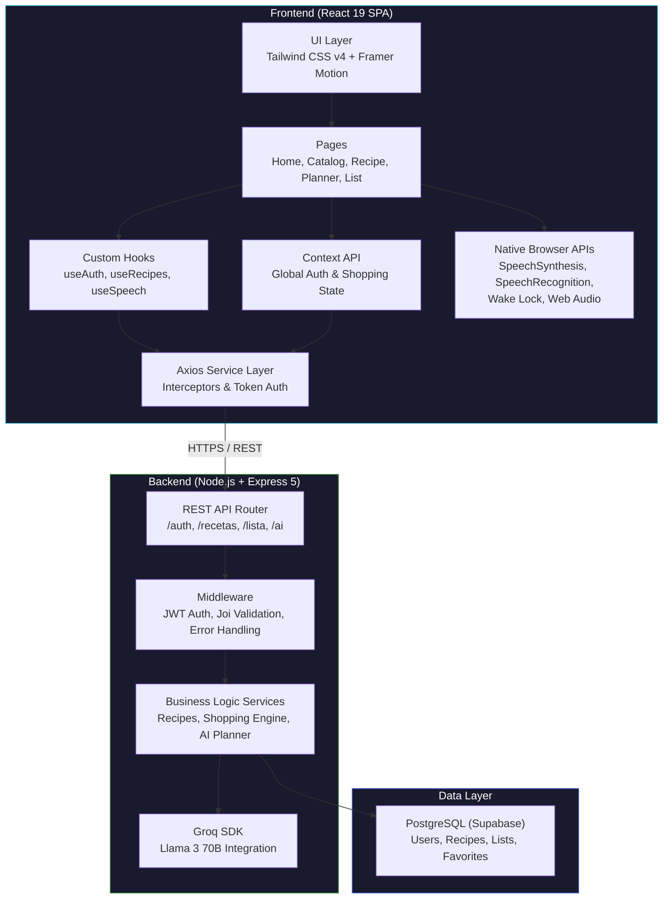

# Architecture and Tech Stack

**Project:** Recetas Hacendado  
**Version:** 2.0 (Final)  

> This document details the technical architecture of Recetas Hacendado. It is designed to be highly modular, separating concerns between presentation, client logic, APIs, and data access, ensuring that the application remains maintainable and scalable.

---

## 1. High-Level Architecture

The system follows a classic decoupled client-server architecture, enhanced with modern AI and Browser capabilities.



---

## 2. Technology Stack

### Frontend
- **React 19 + Vite 8**: Chose Vite for near-instant HMR and fast production builds. React 19's concurrent features improve rendering for heavy lists (like the shopping cart).
- **Tailwind CSS v4**: Utility-first CSS to strictly replicate Mercadona's design system using custom design tokens without maintaining massive CSS files.
- **React Router DOM v7**: Declarative nested routing.
- **Framer Motion**: Smooth, performant micro-animations (e.g., bottom sheets opening, items crossing off the list).
- **Native Browser APIs**: 
  - `SpeechSynthesis` & `SpeechRecognition` for the Hands-Free Cooking Mode and AI dictation.
  - `navigator.wakeLock` to prevent the screen from sleeping while cooking.
  - `navigator.vibrate` and Web Audio API for timer haptics and chimes.

### Backend
- **Node.js + Express 5**: Express 5 natively handles asynchronous errors, eliminating the need for wrapper `try/catch` functions or `express-async-errors`.
- **Groq SDK (Llama 3 70B)**: Used instead of OpenAI. Groq's LPU architecture provides instant inference (tokens per second), which is crucial for real-time meal planning and voice chat experiences.
- **PostgreSQL (Supabase)**: Managed relational database. Chosen for robust relational integrity (ingredients mapped to Hacendado products), built-in connection pooling, and excellent free tier.
- **JWT & bcryptjs**: Stateless, scalable authentication.
- **Joi**: Strict request schema validation at the middleware level.

---

## 3. Database Schema Design (PostgreSQL)

The database is heavily normalized to ensure accurate price calculations and shopping list aggregations.

### Core Entities
- **Usuarios**: Handles authentication (`email`, `password_hash`).
- **Preferencias_Usuario**: Separated table (`tipo: VEGANO, SIN_GLUTEN`) to allow scaling to multiple active dietary preferences per user.
- **Recetas**: Master recipe data (`tiempo_minutos`, `raciones_base`).
- **Pasos_Receta**: Ordered steps for the cooking mode.
- **Productos_Hacendado**: The actual supermarket inventory, tracking `precio`, `unidad_venta` (e.g. "500g"), and supermarket aisles (`seccion_tienda`).
- **Ingredientes_Receta**: Maps recipes to actual `Productos_Hacendado`, holding the `cantidad_base` required for `raciones_base`.
- **Listas_Compra & Items_Lista**: Tracks the user's active cart.

### Scalability Principles in DB
- **ON CONFLICT DO UPDATE**: Used extensively in the Shopping List engine for the "Smart Sum" feature. Instead of race conditions when adding recipes concurrently, the DB handles upserts atomically.
- **GIN Indexes**: Full-text search on `recetas.nombre` using `to_tsvector('spanish', nombre)` for lightning-fast search without external tools like Elasticsearch.

---

## 4. Key Business Logic Implementations

### Smart Shopping Consolidation Engine
When a user adds a recipe (e.g., requires 200ml of Olive Oil) and later adds another (requires 150ml of Olive Oil), the backend service calculates the proportional amounts based on the selected servings and aggregates them atomically in PostgreSQL.

```javascript
// A simplified view of the consolidation logic
for (const ing of ingredientes) {
  await db.query(`
    INSERT INTO items_lista (lista_id, producto_id, cantidad_total, unidad)
    VALUES ($1, $2, $3, $4)
    ON CONFLICT (lista_id, producto_id)
    DO UPDATE SET
      cantidad_total = items_lista.cantidad_total + EXCLUDED.cantidad_total,
      updated_at = NOW()
  `, [lista.id, ing.producto_id, ing.cantidad, ing.unidad]);
}
```

### Proportional Price Calculation
Price is not static. If a recipe needs 250g of a product that costs 2.00€ per 500g package, the backend computes the exact fractional cost to give the user a precise estimated price.

---

## 5. Security & Robustness

- **JWT Auth**: Tokens stored securely in the client context, validated via middleware (`auth.middleware.js`) on every protected route.
- **Global Error Handling**: Express 5 error middleware catches all rejections and formats them into a standard `{ error: "msg", code: "CODE" }` JSON response for predictable frontend handling.
- **Input Validation**: Joi middleware intercepts malformed requests before they hit the controllers, preventing SQL injections or application crashes.

---

## 6. Future Architectural Roadmap

- **Redis Caching**: Cache the `/api/v1/recetas` catalog to reduce PostgreSQL load.
- **Rate Limiting**: Protect the Groq AI endpoints from abuse using IP-based rate limiting middleware.
- **React Native Port**: Because the backend API uses strict JSON contracts and the DB logic is centralized, porting the frontend to React Native (Expo) would only require rewriting the UI layer.
